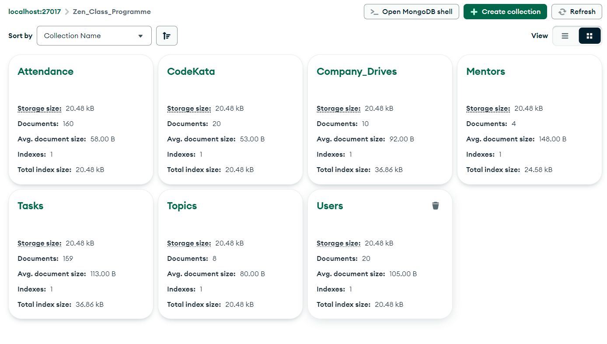
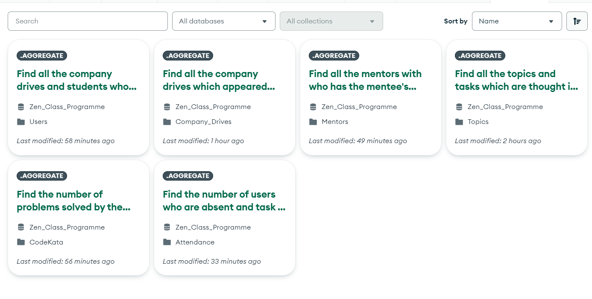

# **Zen Class Programme - Mongo DB Task**

1. The 7 Collections namely Users, Codekata, Attendance, Topics, Taks, Company_Drives and Mentors are initially made. Then I attached the screenshots of those collections. 

2. Then I added the 6 queries and their o/p to fetch those data. Screenshot of Queries attached along with the code at the end for your reference.


## Database Creation
### 1. Users Creation
``
[{
  "_id": {
    "$oid": "64fedaa9c877bf3677214911"
  },
  "userId": 1,
  "userName": "Shanmugam",
  "userEmail": "shanmugam@gmail.com",
  "mentorId": 1
},
{
  "_id": {
    "$oid": "64fedaa9c877bf3677214912"
  },
  "userId": 2,
  "userName": "Swastic",
  "userEmail": "swastic@gmail.com",
  "mentorId": 2
},
{
  "_id": {
    "$oid": "64fedaa9c877bf3677214913"
  },
  "userId": 3,
  "userName": "koushik",
  "userEmail": "koushik@gmail.com",
  "mentorId": 3
},
{
  "_id": {
    "$oid": "64fedaa9c877bf3677214914"
  },
  "userId": 4,
  "userName": "Ajil Arafath",
  "userEmail": "Ajilarafath@gmail.com",
  "mentorId": 1
},
{
  "_id": {
    "$oid": "64fedaa9c877bf3677214915"
  },
  "userId": 5,
  "userName": "Parandhaban",
  "userEmail": "parandhaban@gmail.com",
  "mentorId": 2
},
{
  "_id": {
    "$oid": "64fedaa9c877bf3677214916"
  },
  "userId": 6,
  "userName": "tamilazhagan",
  "userEmail": "tamilazhagan@gmail.com",
  "mentorId": 3
},
{
  "_id": {
    "$oid": "64fedaa9c877bf3677214917"
  },
  "userId": 7,
  "userName": "vijay",
  "userEmail": "vijay@gmail.com",
  "mentorId": 1
},
{
  "_id": {
    "$oid": "64fedaa9c877bf3677214918"
  },
  "userId": 8,
  "userName": "gopinath",
  "userEmail": "gopinath@gmail.com",
  "mentorId": 1
},
{
  "_id": {
    "$oid": "64fedaa9c877bf3677214919"
  },
  "userId": 9,
  "userName": "muzamil",
  "userEmail": "muzamil@gmail.com",
  "mentorId": 1
},
{
  "_id": {
    "$oid": "64fedaa9c877bf367721491a"
  },
  "userId": 10,
  "userName": "sasidharan",
  "userEmail": "sasidharan@gmail.com",
  "mentorId": 1
},
{
  "_id": {
    "$oid": "64fedaa9c877bf367721491b"
  },
  "userId": 11,
  "userName": "mathew",
  "userEmail": "mathew@gmail.com",
  "mentorId": 1
},
{
  "_id": {
    "$oid": "64fedaa9c877bf367721491c"
  },
  "userId": 12,
  "userName": "priyanka",
  "userEmail": "priyanka@gmail.com",
  "mentorId": 1
},
{
  "_id": {
    "$oid": "64fedaa9c877bf367721491d"
  },
  "userId": 13,
  "userName": "sangeetha",
  "userEmail": "sangeetha@gmail.com",
  "mentorId": 1
},
{
  "_id": {
    "$oid": "64fedaa9c877bf367721491e"
  },
  "userId": 14,
  "userName": "jemi",
  "userEmail": "jemi@gmail.com",
  "mentorId": 1
},
{
  "_id": {
    "$oid": "64fedaa9c877bf367721491f"
  },
  "userId": 15,
  "userName": "anandhi",
  "userEmail": "anandhi@gmail.com",
  "mentorId": 1
},
{
  "_id": {
    "$oid": "64fedaa9c877bf3677214920"
  },
  "userId": 16,
  "userName": "gopinatha",
  "userEmail": "gopinatha@gmail.com",
  "mentorId": 1
},
{
  "_id": {
    "$oid": "64fedaa9c877bf3677214921"
  },
  "userId": 17,
  "userName": "saikrupa",
  "userEmail": "saikrupa@gmail.com",
  "mentorId": 1
},
{
  "_id": {
    "$oid": "64fedaa9c877bf3677214922"
  },
  "userId": 18,
  "userName": "bhuvana",
  "userEmail": "bhuvana@gmail.com",
  "mentorId": 1
},
{
  "_id": {
    "$oid": "64fedaa9c877bf3677214923"
  },
  "userId": 19,
  "userName": "pavithra",
  "userEmail": "pavithra@gmail.com",
  "mentorId": 1
},
{
  "_id": {
    "$oid": "64fedaa9c877bf3677214924"
  },
  "userId": 20,
  "userName": "sowmiya",
  "userEmail": "sowmiya@gmail.com",
  "mentorId": 1
}]
``

``` 
db.getCollection('Users').find({});
```

### 2.codekata

``` [{
  "_id": {
    "$oid": "64fedb09c877bf3677214927"
  },
  "userId": 1,
  "problemSolved": 13
},
{
  "_id": {
    "$oid": "64fedb09c877bf3677214928"
  },
  "userId": 2,
  "problemSolved": 11
},
{
  "_id": {
    "$oid": "64fedb09c877bf3677214929"
  },
  "userId": 3,
  "problemSolved": 16
},
{
  "_id": {
    "$oid": "64fedb09c877bf367721492a"
  },
  "userId": 4,
  "problemSolved": 31
},
{
  "_id": {
    "$oid": "64fedb09c877bf367721492b"
  },
  "userId": 5,
  "problemSolved": 33
},
{
  "_id": {
    "$oid": "64fedb09c877bf367721492c"
  },
  "userId": 6,
  "problemSolved": 36
},
{
  "_id": {
    "$oid": "64fedb09c877bf367721492d"
  },
  "userId": 7,
  "problemSolved": 61
},
{
  "_id": {
    "$oid": "64fedb09c877bf367721492e"
  },
  "userId": 8,
  "problemSolved": 63
},
{
  "_id": {
    "$oid": "64fedb09c877bf367721492f"
  },
  "userId": 9,
  "problemSolved": 66
},
{
  "_id": {
    "$oid": "64fedb09c877bf3677214930"
  },
  "userId": 10,
  "problemSolved": 66
},
{
  "_id": {
    "$oid": "64fedb09c877bf3677214931"
  },
  "userId": 11,
  "problemSolved": 63
},
{
  "_id": {
    "$oid": "64fedb09c877bf3677214932"
  },
  "userId": 12,
  "problemSolved": 16
},
{
  "_id": {
    "$oid": "64fedb09c877bf3677214933"
  },
  "userId": 13,
  "problemSolved": 61
},
{
  "_id": {
    "$oid": "64fedb09c877bf3677214934"
  },
  "userId": 14,
  "problemSolved": 36
},
{
  "_id": {
    "$oid": "64fedb09c877bf3677214935"
  },
  "userId": 15,
  "problemSolved": 33
},
{
  "_id": {
    "$oid": "64fedb09c877bf3677214936"
  },
  "userId": 16,
  "problemSolved": 13
},
{
  "_id": {
    "$oid": "64fedb09c877bf3677214937"
  },
  "userId": 17,
  "problemSolved": 31
},
{
  "_id": {
    "$oid": "64fedb09c877bf3677214938"
  },
  "userId": 18,
  "problemSolved": 16
},
{
  "_id": {
    "$oid": "64fedb09c877bf3677214939"
  },
  "userId": 19,
  "problemSolved": 13
},
{
  "_id": {
    "$oid": "64fedb09c877bf367721493a"
  },
  "userId": 20,
  "problemSolved": 11
}] 
```

```
db.getCollection('CodeKata').find({});

```

### 3.Attendance


```

[{
  "_id": {
    "$oid": "64fedc53c877bf3677214944"
  },
  "userId": 1,
  "topicId": 1,
  "attended": true
},
{
  "_id": {
    "$oid": "64fedc53c877bf3677214945"
  },
  "userId": 2,
  "topicId": 1,
  "attended": true
},
{
  "_id": {
    "$oid": "64fedc53c877bf3677214946"
  },
  "userId": 3,
  "topicId": 1,
  "attended": true
},
{
  "_id": {
    "$oid": "64fedc53c877bf3677214947"
  },
  "userId": 4,
  "topicId": 1,
  "attended": true
},
{
  "_id": {
    "$oid": "64fedc53c877bf3677214948"
  },
  "userId": 5,
  "topicId": 1,
  "attended": true
},
{
  "_id": {
    "$oid": "64fedc53c877bf3677214949"
  },
  "userId": 6,
  "topicId": 1,
  "attended": false
},
{
  "_id": {
    "$oid": "64fedc53c877bf367721494a"
  },
  "userId": 7,
  "topicId": 1,
  "attended": true
},
{
  "_id": {
    "$oid": "64fedc53c877bf367721494b"
  },
  "userId": 8,
  "topicId": 1,
  "attended": true
},
{
  "_id": {
    "$oid": "64fedc53c877bf367721494c"
  },
  "userId": 9,
  "topicId": 1,
  "attended": true
},
{
  "_id": {
    "$oid": "64fedc53c877bf367721494d"
  },
  "userId": 10,
  "topicId": 1,
  "attended": false
},
{
  "_id": {
    "$oid": "64fedc53c877bf367721494e"
  },
  "userId": 11,
  "topicId": 1,
  "attended": true
},
{
  "_id": {
    "$oid": "64fedc53c877bf367721494f"
  },
  "userId": 12,
  "topicId": 1,
  "attended": true
},
{
  "_id": {
    "$oid": "64fedc53c877bf3677214950"
  },
  "userId": 13,
  "topicId": 1,
  "attended": true
},
{
  "_id": {
    "$oid": "64fedc53c877bf3677214951"
  },
  "userId": 14,
  "topicId": 1,
  "attended": true
},
{
  "_id": {
    "$oid": "64fedc53c877bf3677214952"
  },
  "userId": 15,
  "topicId": 1,
  "attended": true
},
{
  "_id": {
    "$oid": "64fedc53c877bf3677214953"
  },
  "userId": 16,
  "topicId": 1,
  "attended": true
},
{
  "_id": {
    "$oid": "64fedc53c877bf3677214954"
  },
  "userId": 17,
  "topicId": 1,
  "attended": true
},
{
  "_id": {
    "$oid": "64fedc53c877bf3677214955"
  },
  "userId": 18,
  "topicId": 1,
  "attended": false
},
{
  "_id": {
    "$oid": "64fedc53c877bf3677214956"
  },
  "userId": 19,
  "topicId": 1,
  "attended": true
},
{
  "_id": {
    "$oid": "64fedc53c877bf3677214957"
  },
  "userId": 20,
  "topicId": 1,
  "attended": true
},
{
  "_id": {
    "$oid": "64fedc53c877bf3677214958"
  },
  "userId": 1,
  "topicId": 2,
  "attended": true
},
{
  "_id": {
    "$oid": "64fedc53c877bf3677214959"
  },
  "userId": 2,
  "topicId": 2,
  "attended": false
},
{
  "_id": {
    "$oid": "64fedc53c877bf367721495a"
  },
  "userId": 3,
  "topicId": 2,
  "attended": true
},
{
  "_id": {
    "$oid": "64fedc53c877bf367721495b"
  },
  "userId": 4,
  "topicId": 2,
  "attended": true
},
{
  "_id": {
    "$oid": "64fedc53c877bf367721495c"
  },
  "userId": 5,
  "topicId": 2,
  "attended": true
},
{
  "_id": {
    "$oid": "64fedc53c877bf367721495d"
  },
  "userId": 6,
  "topicId": 2,
  "attended": true
},
{
  "_id": {
    "$oid": "64fedc53c877bf367721495e"
  },
  "userId": 7,
  "topicId": 2,
  "attended": true
},
{
  "_id": {
    "$oid": "64fedc53c877bf367721495f"
  },
  "userId": 8,
  "topicId": 2,
  "attended": true
},
{
  "_id": {
    "$oid": "64fedc53c877bf3677214960"
  },
  "userId": 9,
  "topicId": 2,
  "attended": true
},
{
  "_id": {
    "$oid": "64fedc53c877bf3677214961"
  },
  "userId": 10,
  "topicId": 2,
  "attended": false
},
{
  "_id": {
    "$oid": "64fedc53c877bf3677214962"
  },
  "userId": 11,
  "topicId": 2,
  "attended": true
},
{
  "_id": {
    "$oid": "64fedc53c877bf3677214963"
  },
  "userId": 12,
  "topicId": 2,
  "attended": true
},
{
  "_id": {
    "$oid": "64fedc53c877bf3677214964"
  },
  "userId": 13,
  "topicId": 2,
  "attended": true
},
{
  "_id": {
    "$oid": "64fedc53c877bf3677214965"
  },
  "userId": 14,
  "topicId": 2,
  "attended": true
},
{
  "_id": {
    "$oid": "64fedc53c877bf3677214966"
  },
  "userId": 15,
  "topicId": 2,
  "attended": true
},
{
  "_id": {
    "$oid": "64fedc53c877bf3677214967"
  },
  "userId": 16,
  "topicId": 2,
  "attended": true
},
{
  "_id": {
    "$oid": "64fedc53c877bf3677214968"
  },
  "userId": 17,
  "topicId": 2,
  "attended": true
},
{
  "_id": {
    "$oid": "64fedc53c877bf3677214969"
  },
  "userId": 18,
  "topicId": 2,
  "attended": true
},
{
  "_id": {
    "$oid": "64fedc53c877bf367721496a"
  },
  "userId": 19,
  "topicId": 2,
  "attended": true
},
{
  "_id": {
    "$oid": "64fedc53c877bf367721496b"
  },
  "userId": 20,
  "topicId": 2,
  "attended": true
},
{
  "_id": {
    "$oid": "64fedc53c877bf367721496c"
  },
  "userId": 1,
  "topicId": 3,
  "attended": true
},
{
  "_id": {
    "$oid": "64fedc53c877bf367721496d"
  },
  "userId": 2,
  "topicId": 3,
  "attended": true
},
{
  "_id": {
    "$oid": "64fedc53c877bf367721496e"
  },
  "userId": 3,
  "topicId": 3,
  "attended": false
},
{
  "_id": {
    "$oid": "64fedc53c877bf367721496f"
  },
  "userId": 4,
  "topicId": 3,
  "attended": true
},
{
  "_id": {
    "$oid": "64fedc53c877bf3677214970"
  },
  "userId": 5,
  "topicId": 3,
  "attended": true
},
{
  "_id": {
    "$oid": "64fedc53c877bf3677214971"
  },
  "userId": 6,
  "topicId": 3,
  "attended": true
},
{
  "_id": {
    "$oid": "64fedc53c877bf3677214972"
  },
  "userId": 7,
  "topicId": 3,
  "attended": true
},
{
  "_id": {
    "$oid": "64fedc53c877bf3677214973"
  },
  "userId": 8,
  "topicId": 3,
  "attended": true
},
{
  "_id": {
    "$oid": "64fedc53c877bf3677214974"
  },
  "userId": 9,
  "topicId": 3,
  "attended": true
},
{
  "_id": {
    "$oid": "64fedc53c877bf3677214975"
  },
  "userId": 10,
  "topicId": 3,
  "attended": true
},
{
  "_id": {
    "$oid": "64fedc53c877bf3677214976"
  },
  "userId": 11,
  "topicId": 3,
  "attended": true
},
{
  "_id": {
    "$oid": "64fedc53c877bf3677214977"
  },
  "userId": 12,
  "topicId": 3,
  "attended": true
},
{
  "_id": {
    "$oid": "64fedc53c877bf3677214978"
  },
  "userId": 13,
  "topicId": 3,
  "attended": true
},
{
  "_id": {
    "$oid": "64fedc53c877bf3677214979"
  },
  "userId": 14,
  "topicId": 3,
  "attended": true
},
{
  "_id": {
    "$oid": "64fedc53c877bf367721497a"
  },
  "userId": 15,
  "topicId": 3,
  "attended": true
},
{
  "_id": {
    "$oid": "64fedc53c877bf367721497b"
  },
  "userId": 16,
  "topicId": 3,
  "attended": true
},
{
  "_id": {
    "$oid": "64fedc53c877bf367721497c"
  },
  "userId": 17,
  "topicId": 3,
  "attended": false
},
{
  "_id": {
    "$oid": "64fedc53c877bf367721497d"
  },
  "userId": 18,
  "topicId": 3,
  "attended": true
},
{
  "_id": {
    "$oid": "64fedc53c877bf367721497e"
  },
  "userId": 19,
  "topicId": 3,
  "attended": true
},
{
  "_id": {
    "$oid": "64fedc53c877bf367721497f"
  },
  "userId": 20,
  "topicId": 3,
  "attended": true
},
{
  "_id": {
    "$oid": "64fedc53c877bf3677214980"
  },
  "userId": 1,
  "topicId": 4,
  "attended": true
},
{
  "_id": {
    "$oid": "64fedc53c877bf3677214981"
  },
  "userId": 2,
  "topicId": 4,
  "attended": true
},
{
  "_id": {
    "$oid": "64fedc53c877bf3677214982"
  },
  "userId": 3,
  "topicId": 4,
  "attended": true
},
{
  "_id": {
    "$oid": "64fedc53c877bf3677214983"
  },
  "userId": 4,
  "topicId": 4,
  "attended": true
},
{
  "_id": {
    "$oid": "64fedc53c877bf3677214984"
  },
  "userId": 5,
  "topicId": 4,
  "attended": true
},
{
  "_id": {
    "$oid": "64fedc53c877bf3677214985"
  },
  "userId": 6,
  "topicId": 4,
  "attended": true
},
{
  "_id": {
    "$oid": "64fedc53c877bf3677214986"
  },
  "userId": 7,
  "topicId": 4,
  "attended": true
},
{
  "_id": {
    "$oid": "64fedc53c877bf3677214987"
  },
  "userId": 8,
  "topicId": 4,
  "attended": true
},
{
  "_id": {
    "$oid": "64fedc53c877bf3677214988"
  },
  "userId": 9,
  "topicId": 4,
  "attended": true
},
{
  "_id": {
    "$oid": "64fedc53c877bf3677214989"
  },
  "userId": 10,
  "topicId": 4,
  "attended": true
},
{
  "_id": {
    "$oid": "64fedc53c877bf367721498a"
  },
  "userId": 11,
  "topicId": 4,
  "attended": true
},
{
  "_id": {
    "$oid": "64fedc53c877bf367721498b"
  },
  "userId": 12,
  "topicId": 4,
  "attended": true
},
{
  "_id": {
    "$oid": "64fedc53c877bf367721498c"
  },
  "userId": 13,
  "topicId": 4,
  "attended": true
},
{
  "_id": {
    "$oid": "64fedc53c877bf367721498d"
  },
  "userId": 14,
  "topicId": 4,
  "attended": true
},
{
  "_id": {
    "$oid": "64fedc53c877bf367721498e"
  },
  "userId": 15,
  "topicId": 4,
  "attended": true
},
{
  "_id": {
    "$oid": "64fedc53c877bf367721498f"
  },
  "userId": 16,
  "topicId": 4,
  "attended": true
},
{
  "_id": {
    "$oid": "64fedc53c877bf3677214990"
  },
  "userId": 17,
  "topicId": 4,
  "attended": true
},
{
  "_id": {
    "$oid": "64fedc53c877bf3677214991"
  },
  "userId": 18,
  "topicId": 4,
  "attended": false
},
{
  "_id": {
    "$oid": "64fedc53c877bf3677214992"
  },
  "userId": 19,
  "topicId": 4,
  "attended": true
},
{
  "_id": {
    "$oid": "64fedc53c877bf3677214993"
  },
  "userId": 20,
  "topicId": 4,
  "attended": true
},
{
  "_id": {
    "$oid": "64fedc53c877bf3677214994"
  },
  "userId": 1,
  "topicId": 5,
  "attended": true
},
{
  "_id": {
    "$oid": "64fedc53c877bf3677214995"
  },
  "userId": 2,
  "topicId": 5,
  "attended": true
},
{
  "_id": {
    "$oid": "64fedc53c877bf3677214996"
  },
  "userId": 3,
  "topicId": 5,
  "attended": true
},
{
  "_id": {
    "$oid": "64fedc53c877bf3677214997"
  },
  "userId": 4,
  "topicId": 5,
  "attended": true
},
{
  "_id": {
    "$oid": "64fedc53c877bf3677214998"
  },
  "userId": 5,
  "topicId": 5,
  "attended": true
},
{
  "_id": {
    "$oid": "64fedc53c877bf3677214999"
  },
  "userId": 6,
  "topicId": 5,
  "attended": true
},
{
  "_id": {
    "$oid": "64fedc53c877bf367721499a"
  },
  "userId": 7,
  "topicId": 5,
  "attended": true
},
{
  "_id": {
    "$oid": "64fedc53c877bf367721499b"
  },
  "userId": 8,
  "topicId": 5,
  "attended": true
},
{
  "_id": {
    "$oid": "64fedc53c877bf367721499c"
  },
  "userId": 9,
  "topicId": 5,
  "attended": true
},
{
  "_id": {
    "$oid": "64fedc53c877bf367721499d"
  },
  "userId": 10,
  "topicId": 5,
  "attended": true
},
{
  "_id": {
    "$oid": "64fedc53c877bf367721499e"
  },
  "userId": 11,
  "topicId": 5,
  "attended": true
},
{
  "_id": {
    "$oid": "64fedc53c877bf367721499f"
  },
  "userId": 12,
  "topicId": 5,
  "attended": false
},
{
  "_id": {
    "$oid": "64fedc53c877bf36772149a0"
  },
  "userId": 13,
  "topicId": 5,
  "attended": true
},
{
  "_id": {
    "$oid": "64fedc53c877bf36772149a1"
  },
  "userId": 14,
  "topicId": 5,
  "attended": true
},
{
  "_id": {
    "$oid": "64fedc53c877bf36772149a2"
  },
  "userId": 15,
  "topicId": 5,
  "attended": true
},
{
  "_id": {
    "$oid": "64fedc53c877bf36772149a3"
  },
  "userId": 16,
  "topicId": 5,
  "attended": true
},
{
  "_id": {
    "$oid": "64fedc53c877bf36772149a4"
  },
  "userId": 17,
  "topicId": 5,
  "attended": true
},
{
  "_id": {
    "$oid": "64fedc53c877bf36772149a5"
  },
  "userId": 18,
  "topicId": 5,
  "attended": true
},
{
  "_id": {
    "$oid": "64fedc53c877bf36772149a6"
  },
  "userId": 19,
  "topicId": 5,
  "attended": true
},
{
  "_id": {
    "$oid": "64fedc53c877bf36772149a7"
  },
  "userId": 20,
  "topicId": 5,
  "attended": true
},
{
  "_id": {
    "$oid": "64fedc53c877bf36772149a8"
  },
  "userId": 1,
  "topicId": 6,
  "attended": true
},
{
  "_id": {
    "$oid": "64fedc53c877bf36772149a9"
  },
  "userId": 2,
  "topicId": 6,
  "attended": true
},
{
  "_id": {
    "$oid": "64fedc53c877bf36772149aa"
  },
  "userId": 3,
  "topicId": 6,
  "attended": true
},
{
  "_id": {
    "$oid": "64fedc53c877bf36772149ab"
  },
  "userId": 4,
  "topicId": 6,
  "attended": true
},
{
  "_id": {
    "$oid": "64fedc53c877bf36772149ac"
  },
  "userId": 5,
  "topicId": 6,
  "attended": false
},
{
  "_id": {
    "$oid": "64fedc53c877bf36772149ad"
  },
  "userId": 6,
  "topicId": 6,
  "attended": true
},
{
  "_id": {
    "$oid": "64fedc53c877bf36772149ae"
  },
  "userId": 7,
  "topicId": 6,
  "attended": true
},
{
  "_id": {
    "$oid": "64fedc53c877bf36772149af"
  },
  "userId": 8,
  "topicId": 6,
  "attended": true
},
{
  "_id": {
    "$oid": "64fedc53c877bf36772149b0"
  },
  "userId": 9,
  "topicId": 6,
  "attended": true
},
{
  "_id": {
    "$oid": "64fedc53c877bf36772149b1"
  },
  "userId": 10,
  "topicId": 6,
  "attended": true
},
{
  "_id": {
    "$oid": "64fedc53c877bf36772149b2"
  },
  "userId": 11,
  "topicId": 6,
  "attended": true
},
{
  "_id": {
    "$oid": "64fedc53c877bf36772149b3"
  },
  "userId": 12,
  "topicId": 6,
  "attended": true
},
{
  "_id": {
    "$oid": "64fedc53c877bf36772149b4"
  },
  "userId": 13,
  "topicId": 6,
  "attended": true
},
{
  "_id": {
    "$oid": "64fedc53c877bf36772149b5"
  },
  "userId": 14,
  "topicId": 6,
  "attended": true
},
{
  "_id": {
    "$oid": "64fedc53c877bf36772149b6"
  },
  "userId": 15,
  "topicId": 6,
  "attended": true
},
{
  "_id": {
    "$oid": "64fedc53c877bf36772149b7"
  },
  "userId": 16,
  "topicId": 6,
  "attended": false
},
{
  "_id": {
    "$oid": "64fedc53c877bf36772149b8"
  },
  "userId": 17,
  "topicId": 6,
  "attended": true
},
{
  "_id": {
    "$oid": "64fedc53c877bf36772149b9"
  },
  "userId": 18,
  "topicId": 6,
  "attended": true
},
{
  "_id": {
    "$oid": "64fedc53c877bf36772149ba"
  },
  "userId": 19,
  "topicId": 6,
  "attended": true
},
{
  "_id": {
    "$oid": "64fedc53c877bf36772149bb"
  },
  "userId": 20,
  "topicId": 6,
  "attended": true
},
{
  "_id": {
    "$oid": "64fedc53c877bf36772149bc"
  },
  "userId": 1,
  "topicId": 7,
  "attended": true
},
{
  "_id": {
    "$oid": "64fedc53c877bf36772149bd"
  },
  "userId": 2,
  "topicId": 7,
  "attended": true
},
{
  "_id": {
    "$oid": "64fedc53c877bf36772149be"
  },
  "userId": 3,
  "topicId": 7,
  "attended": true
},
{
  "_id": {
    "$oid": "64fedc53c877bf36772149bf"
  },
  "userId": 4,
  "topicId": 7,
  "attended": true
},
{
  "_id": {
    "$oid": "64fedc53c877bf36772149c0"
  },
  "userId": 5,
  "topicId": 7,
  "attended": true
},
{
  "_id": {
    "$oid": "64fedc53c877bf36772149c1"
  },
  "userId": 6,
  "topicId": 7,
  "attended": true
},
{
  "_id": {
    "$oid": "64fedc53c877bf36772149c2"
  },
  "userId": 7,
  "topicId": 7,
  "attended": true
},
{
  "_id": {
    "$oid": "64fedc53c877bf36772149c3"
  },
  "userId": 8,
  "topicId": 7,
  "attended": true
},
{
  "_id": {
    "$oid": "64fedc53c877bf36772149c4"
  },
  "userId": 9,
  "topicId": 7,
  "attended": false
},
{
  "_id": {
    "$oid": "64fedc53c877bf36772149c5"
  },
  "userId": 10,
  "topicId": 7,
  "attended": true
},
{
  "_id": {
    "$oid": "64fedc53c877bf36772149c6"
  },
  "userId": 11,
  "topicId": 7,
  "attended": true
},
{
  "_id": {
    "$oid": "64fedc53c877bf36772149c7"
  },
  "userId": 12,
  "topicId": 7,
  "attended": true
},
{
  "_id": {
    "$oid": "64fedc53c877bf36772149c8"
  },
  "userId": 13,
  "topicId": 7,
  "attended": true
},
{
  "_id": {
    "$oid": "64fedc53c877bf36772149c9"
  },
  "userId": 14,
  "topicId": 7,
  "attended": true
},
{
  "_id": {
    "$oid": "64fedc53c877bf36772149ca"
  },
  "userId": 15,
  "topicId": 7,
  "attended": true
},
{
  "_id": {
    "$oid": "64fedc53c877bf36772149cb"
  },
  "userId": 16,
  "topicId": 7,
  "attended": true
},
{
  "_id": {
    "$oid": "64fedc53c877bf36772149cc"
  },
  "userId": 17,
  "topicId": 7,
  "attended": false
},
{
  "_id": {
    "$oid": "64fedc53c877bf36772149cd"
  },
  "userId": 18,
  "topicId": 7,
  "attended": true
},
{
  "_id": {
    "$oid": "64fedc53c877bf36772149ce"
  },
  "userId": 19,
  "topicId": 7,
  "attended": true
},
{
  "_id": {
    "$oid": "64fedc53c877bf36772149cf"
  },
  "userId": 20,
  "topicId": 7,
  "attended": true
},
{
  "_id": {
    "$oid": "64fedc53c877bf36772149d0"
  },
  "userId": 1,
  "topicId": 8,
  "attended": true
},
{
  "_id": {
    "$oid": "64fedc53c877bf36772149d1"
  },
  "userId": 2,
  "topicId": 8,
  "attended": true
},
{
  "_id": {
    "$oid": "64fedc53c877bf36772149d2"
  },
  "userId": 3,
  "topicId": 8,
  "attended": true
},
{
  "_id": {
    "$oid": "64fedc53c877bf36772149d3"
  },
  "userId": 4,
  "topicId": 8,
  "attended": false
},
{
  "_id": {
    "$oid": "64fedc53c877bf36772149d4"
  },
  "userId": 5,
  "topicId": 8,
  "attended": true
},
{
  "_id": {
    "$oid": "64fedc53c877bf36772149d5"
  },
  "userId": 6,
  "topicId": 8,
  "attended": true
},
{
  "_id": {
    "$oid": "64fedc53c877bf36772149d6"
  },
  "userId": 7,
  "topicId": 8,
  "attended": true
},
{
  "_id": {
    "$oid": "64fedc53c877bf36772149d7"
  },
  "userId": 8,
  "topicId": 8,
  "attended": true
},
{
  "_id": {
    "$oid": "64fedc53c877bf36772149d8"
  },
  "userId": 9,
  "topicId": 8,
  "attended": true
},
{
  "_id": {
    "$oid": "64fedc53c877bf36772149d9"
  },
  "userId": 10,
  "topicId": 8,
  "attended": true
},
{
  "_id": {
    "$oid": "64fedc53c877bf36772149da"
  },
  "userId": 11,
  "topicId": 8,
  "attended": true
},
{
  "_id": {
    "$oid": "64fedc53c877bf36772149db"
  },
  "userId": 12,
  "topicId": 8,
  "attended": true
},
{
  "_id": {
    "$oid": "64fedc53c877bf36772149dc"
  },
  "userId": 13,
  "topicId": 8,
  "attended": true
},
{
  "_id": {
    "$oid": "64fedc53c877bf36772149dd"
  },
  "userId": 14,
  "topicId": 8,
  "attended": true
},
{
  "_id": {
    "$oid": "64fedc53c877bf36772149de"
  },
  "userId": 15,
  "topicId": 8,
  "attended": false
},
{
  "_id": {
    "$oid": "64fedc53c877bf36772149df"
  },
  "userId": 16,
  "topicId": 8,
  "attended": true
},
{
  "_id": {
    "$oid": "64fedc53c877bf36772149e0"
  },
  "userId": 17,
  "topicId": 8,
  "attended": true
},
{
  "_id": {
    "$oid": "64fedc53c877bf36772149e1"
  },
  "userId": 18,
  "topicId": 8,
  "attended": true
},
{
  "_id": {
    "$oid": "64fedc53c877bf36772149e2"
  },
  "userId": 19,
  "topicId": 8,
  "attended": true
},
{
  "_id": {
    "$oid": "64fedc53c877bf36772149e3"
  },
  "userId": 20,
  "topicId": 8,
  "attended": false
}]

```

```
db.getCollection('Attendance').find({});

```

### 4. Topics

```
[{
  "_id": {
    "$oid": "64fee15bc877bf3677214a9d"
  },
  "topicId": 1,
  "topic": "RWD",
  "topicDate": "2020-10-10"
},
{
  "_id": {
    "$oid": "64fee15bc877bf3677214a9e"
  },
  "topicId": 2,
  "topic": "Bootstrap",
  "topicDate": "2020-10-11"
},
{
  "_id": {
    "$oid": "64fee15bc877bf3677214a9f"
  },
  "topicId": 3,
  "topic": "JS",
  "topicDate": "2020-10-17"
},
{
  "_id": {
    "$oid": "64fee15bc877bf3677214aa0"
  },
  "topicId": 4,
  "topic": "Async Programming",
  "topicDate": "2020-10-18"
},
{
  "_id": {
    "$oid": "64fee15bc877bf3677214aa1"
  },
  "topicId": 5,
  "topic": "React",
  "topicDate": "2020-10-24"
},
{
  "_id": {
    "$oid": "64fee15bc877bf3677214aa2"
  },
  "topicId": 6,
  "topic": "React-Redux",
  "topicDate": "2020-10-25"
},
{
  "_id": {
    "$oid": "64fee15bc877bf3677214aa3"
  },
  "topicId": 7,
  "topic": "MySQL",
  "topicDate": "2020-10-31"
},
{
  "_id": {
    "$oid": "64fee15bc877bf3677214aa4"
  },
  "topicId": 8,
  "topic": "MongoDB",
  "topicDate": "2020-11-01"
}]

```

``` 
db.getCollection('Topics').find({});

```


### 5. Tasks

```
[{
  "_id": {
    "$oid": "64fee115c877bf36772149fc"
  },
  "taskId": 1,
  "topicId": 1,
  "userId": 1,
  "task": "RWD",
  "dueDate": "2020-10-12",
  "submitted": true
},
{
  "_id": {
    "$oid": "64fee115c877bf36772149fd"
  },
  "taskId": 1,
  "topicId": 1,
  "userId": 2,
  "task": "RWD",
  "dueDate": "2020-10-12",
  "submitted": true
},
{
  "_id": {
    "$oid": "64fee115c877bf36772149fe"
  },
  "taskId": 1,
  "topicId": 1,
  "userId": 3,
  "task": "RWD",
  "dueDate": "2020-10-12",
  "submitted": true
},
{
  "_id": {
    "$oid": "64fee115c877bf36772149ff"
  },
  "taskId": 1,
  "topicId": 1,
  "userId": 4,
  "task": "RWD",
  "dueDate": "2020-10-12",
  "submitted": true
},
{
  "_id": {
    "$oid": "64fee115c877bf3677214a00"
  },
  "taskId": 1,
  "topicId": 1,
  "userId": 5,
  "task": "RWD",
  "dueDate": "2020-10-12",
  "submitted": true
},
{
  "_id": {
    "$oid": "64fee115c877bf3677214a01"
  },
  "taskId": 1,
  "topicId": 1,
  "userId": 6,
  "task": "RWD",
  "dueDate": "2020-10-12",
  "submitted": false
},
{
  "_id": {
    "$oid": "64fee115c877bf3677214a02"
  },
  "taskId": 1,
  "topicId": 1,
  "userId": 7,
  "task": "RWD",
  "dueDate": "2020-10-12",
  "submitted": true
},
{
  "_id": {
    "$oid": "64fee115c877bf3677214a03"
  },
  "taskId": 1,
  "topicId": 1,
  "userId": 8,
  "task": "RWD",
  "dueDate": "2020-10-12",
  "submitted": true
},
{
  "_id": {
    "$oid": "64fee115c877bf3677214a04"
  },
  "taskId": 1,
  "topicId": 1,
  "userId": 9,
  "task": "RWD",
  "dueDate": "2020-10-12",
  "submitted": true
},
{
  "_id": {
    "$oid": "64fee115c877bf3677214a05"
  },
  "taskId": 1,
  "topicId": 1,
  "userId": 10,
  "task": "RWD",
  "dueDate": "2020-10-12",
  "submitted": false
},
{
  "_id": {
    "$oid": "64fee115c877bf3677214a06"
  },
  "taskId": 1,
  "topicId": 1,
  "userId": 11,
  "task": "RWD",
  "dueDate": "2020-10-12",
  "submitted": true
},
{
  "_id": {
    "$oid": "64fee115c877bf3677214a07"
  },
  "taskId": 1,
  "topicId": 1,
  "userId": 12,
  "task": "RWD",
  "dueDate": "2020-10-12",
  "submitted": true
},
{
  "_id": {
    "$oid": "64fee115c877bf3677214a08"
  },
  "taskId": 1,
  "topicId": 1,
  "userId": 13,
  "task": "RWD",
  "dueDate": "2020-10-12",
  "submitted": true
},
{
  "_id": {
    "$oid": "64fee115c877bf3677214a09"
  },
  "taskId": 1,
  "topicId": 1,
  "userId": 14,
  "task": "RWD",
  "dueDate": "2020-10-12",
  "submitted": true
},
{
  "_id": {
    "$oid": "64fee115c877bf3677214a0a"
  },
  "taskId": 1,
  "topicId": 1,
  "userId": 15,
  "task": "RWD",
  "dueDate": "2020-10-12",
  "submitted": true
},
{
  "_id": {
    "$oid": "64fee115c877bf3677214a0b"
  },
  "taskId": 1,
  "topicId": 1,
  "userId": 16,
  "task": "RWD",
  "dueDate": "2020-10-12",
  "submitted": true
},
{
  "_id": {
    "$oid": "64fee115c877bf3677214a0c"
  },
  "taskId": 1,
  "topicId": 1,
  "userId": 17,
  "task": "RWD",
  "dueDate": "2020-10-12",
  "submitted": false
},
{
  "_id": {
    "$oid": "64fee115c877bf3677214a0d"
  },
  "taskId": 1,
  "topicId": 1,
  "userId": 18,
  "task": "RWD",
  "dueDate": "2020-10-12",
  "submitted": true
},
{
  "_id": {
    "$oid": "64fee115c877bf3677214a0e"
  },
  "taskId": 1,
  "topicId": 1,
  "userId": 19,
  "task": "RWD",
  "dueDate": "2020-10-12",
  "submitted": false
},
{
  "_id": {
    "$oid": "64fee115c877bf3677214a0f"
  },
  "taskId": 1,
  "topicId": 1,
  "userId": 20,
  "task": "RWD",
  "dueDate": "2020-10-12",
  "submitted": true
},
{
  "_id": {
    "$oid": "64fee115c877bf3677214a10"
  },
  "taskId": 2,
  "topicId": 2,
  "userId": 1,
  "task": "Bootstrap",
  "dueDate": "2020-10-13",
  "submitted": false
},
{
  "_id": {
    "$oid": "64fee115c877bf3677214a11"
  },
  "taskId": 2,
  "topicId": 2,
  "userId": 2,
  "task": "Bootstrap",
  "dueDate": "2020-10-13",
  "submitted": true
},
{
  "_id": {
    "$oid": "64fee115c877bf3677214a12"
  },
  "taskId": 2,
  "topicId": 2,
  "userId": 3,
  "task": "Bootstrap",
  "dueDate": "2020-10-13",
  "submitted": true
},
{
  "_id": {
    "$oid": "64fee115c877bf3677214a13"
  },
  "taskId": 2,
  "topicId": 2,
  "userId": 4,
  "task": "Bootstrap",
  "dueDate": "2020-10-13",
  "submitted": true
},
{
  "_id": {
    "$oid": "64fee115c877bf3677214a14"
  },
  "taskId": 2,
  "topicId": 2,
  "userId": 5,
  "task": "Bootstrap",
  "dueDate": "2020-10-13",
  "submitted": true
},
{
  "_id": {
    "$oid": "64fee115c877bf3677214a15"
  },
  "taskId": 2,
  "topicId": 2,
  "userId": 6,
  "task": "Bootstrap",
  "dueDate": "2020-10-13",
  "submitted": true
},
{
  "_id": {
    "$oid": "64fee115c877bf3677214a16"
  },
  "taskId": 2,
  "topicId": 2,
  "userId": 7,
  "task": "Bootstrap",
  "dueDate": "2020-10-13",
  "submitted": true
},
{
  "_id": {
    "$oid": "64fee115c877bf3677214a17"
  },
  "taskId": 2,
  "topicId": 2,
  "userId": 8,
  "task": "Bootstrap",
  "dueDate": "2020-10-13",
  "submitted": true
},
{
  "_id": {
    "$oid": "64fee115c877bf3677214a18"
  },
  "taskId": 2,
  "topicId": 2,
  "userId": 9,
  "task": "Bootstrap",
  "dueDate": "2020-10-13",
  "submitted": true
},
{
  "_id": {
    "$oid": "64fee115c877bf3677214a19"
  },
  "taskId": 2,
  "topicId": 2,
  "userId": 10,
  "task": "Bootstrap",
  "dueDate": "2020-10-13",
  "submitted": false
},
{
  "_id": {
    "$oid": "64fee115c877bf3677214a1a"
  },
  "taskId": 2,
  "topicId": 2,
  "userId": 11,
  "task": "Bootstrap",
  "dueDate": "2020-10-13",
  "submitted": true
},
{
  "_id": {
    "$oid": "64fee115c877bf3677214a1b"
  },
  "taskId": 2,
  "topicId": 2,
  "userId": 12,
  "task": "Bootstrap",
  "dueDate": "2020-10-13",
  "submitted": true
},
{
  "_id": {
    "$oid": "64fee115c877bf3677214a1c"
  },
  "taskId": 2,
  "topicId": 2,
  "userId": 13,
  "task": "Bootstrap",
  "dueDate": "2020-10-13",
  "submitted": true
},
{
  "_id": {
    "$oid": "64fee115c877bf3677214a1d"
  },
  "taskId": 2,
  "topicId": 2,
  "userId": 14,
  "task": "Bootstrap",
  "dueDate": "2020-10-13",
  "submitted": true
},
{
  "_id": {
    "$oid": "64fee115c877bf3677214a1e"
  },
  "taskId": 2,
  "topicId": 2,
  "userId": 15,
  "task": "Bootstrap",
  "dueDate": "2020-10-13",
  "submitted": true
},
{
  "_id": {
    "$oid": "64fee115c877bf3677214a1f"
  },
  "taskId": 2,
  "topicId": 2,
  "userId": 16,
  "task": "Bootstrap",
  "dueDate": "2020-10-13",
  "submitted": true
},
{
  "_id": {
    "$oid": "64fee115c877bf3677214a20"
  },
  "taskId": 2,
  "topicId": 2,
  "userId": 17,
  "task": "Bootstrap",
  "dueDate": "2020-10-13",
  "submitted": true
},
{
  "_id": {
    "$oid": "64fee115c877bf3677214a21"
  },
  "taskId": 2,
  "topicId": 2,
  "userId": 18,
  "task": "Bootstrap",
  "dueDate": "2020-10-13",
  "submitted": true
},
{
  "_id": {
    "$oid": "64fee115c877bf3677214a22"
  },
  "taskId": 2,
  "topicId": 2,
  "userId": 19,
  "task": "Bootstrap",
  "dueDate": "2020-10-13",
  "submitted": true
},
{
  "_id": {
    "$oid": "64fee115c877bf3677214a23"
  },
  "taskId": 2,
  "topicId": 2,
  "userId": 20,
  "task": "Bootstrap",
  "dueDate": "2020-10-13",
  "submitted": true
},
{
  "_id": {
    "$oid": "64fee115c877bf3677214a24"
  },
  "taskId": 3,
  "topicId": 3,
  "userId": 1,
  "task": "JS",
  "dueDate": "2020-10-19",
  "submitted": false
},
{
  "_id": {
    "$oid": "64fee115c877bf3677214a25"
  },
  "taskId": 3,
  "topicId": 3,
  "userId": 2,
  "task": "JS",
  "dueDate": "2020-10-19",
  "submitted": true
},
{
  "_id": {
    "$oid": "64fee115c877bf3677214a26"
  },
  "taskId": 3,
  "topicId": 3,
  "userId": 3,
  "task": "JS",
  "dueDate": "2020-10-19",
  "submitted": true
},
{
  "_id": {
    "$oid": "64fee115c877bf3677214a27"
  },
  "taskId": 3,
  "topicId": 3,
  "userId": 4,
  "task": "JS",
  "dueDate": "2020-10-19",
  "submitted": true
},
{
  "_id": {
    "$oid": "64fee115c877bf3677214a28"
  },
  "taskId": 3,
  "topicId": 3,
  "userId": 5,
  "task": "JS",
  "dueDate": "2020-10-19",
  "submitted": true
},
{
  "_id": {
    "$oid": "64fee115c877bf3677214a29"
  },
  "taskId": 3,
  "topicId": 3,
  "userId": 6,
  "task": "JS",
  "dueDate": "2020-10-19",
  "submitted": true
},
{
  "_id": {
    "$oid": "64fee115c877bf3677214a2a"
  },
  "taskId": 3,
  "topicId": 3,
  "userId": 7,
  "task": "JS",
  "dueDate": "2020-10-19",
  "submitted": true
},
{
  "_id": {
    "$oid": "64fee115c877bf3677214a2b"
  },
  "taskId": 3,
  "topicId": 3,
  "userId": 8,
  "task": "JS",
  "dueDate": "2020-10-19",
  "submitted": true
},
{
  "_id": {
    "$oid": "64fee115c877bf3677214a2c"
  },
  "taskId": 3,
  "topicId": 3,
  "userId": 9,
  "task": "JS",
  "dueDate": "2020-10-19",
  "submitted": true
},
{
  "_id": {
    "$oid": "64fee115c877bf3677214a2d"
  },
  "taskId": 3,
  "topicId": 3,
  "userId": 10,
  "task": "JS",
  "dueDate": "2020-10-19",
  "submitted": true
},
{
  "_id": {
    "$oid": "64fee115c877bf3677214a2e"
  },
  "taskId": 3,
  "topicId": 3,
  "userId": 11,
  "task": "JS",
  "dueDate": "2020-10-19",
  "submitted": true
},
{
  "_id": {
    "$oid": "64fee115c877bf3677214a2f"
  },
  "taskId": 3,
  "topicId": 3,
  "userId": 12,
  "task": "JS",
  "dueDate": "2020-10-19",
  "submitted": true
},
{
  "_id": {
    "$oid": "64fee115c877bf3677214a30"
  },
  "taskId": 3,
  "topicId": 3,
  "userId": 13,
  "task": "JS",
  "dueDate": "2020-10-19",
  "submitted": true
},
{
  "_id": {
    "$oid": "64fee115c877bf3677214a31"
  },
  "taskId": 3,
  "topicId": 3,
  "userId": 14,
  "task": "JS",
  "dueDate": "2020-10-19",
  "submitted": true
},
{
  "_id": {
    "$oid": "64fee115c877bf3677214a32"
  },
  "taskId": 3,
  "topicId": 3,
  "userId": 15,
  "task": "JS",
  "dueDate": "2020-10-19",
  "submitted": true
},
{
  "_id": {
    "$oid": "64fee115c877bf3677214a33"
  },
  "taskId": 3,
  "topicId": 3,
  "userId": 16,
  "task": "JS",
  "dueDate": "2020-10-19",
  "submitted": true
},
{
  "_id": {
    "$oid": "64fee115c877bf3677214a34"
  },
  "taskId": 3,
  "topicId": 3,
  "userId": 17,
  "task": "JS",
  "dueDate": "2020-10-19",
  "submitted": false
},
{
  "_id": {
    "$oid": "64fee115c877bf3677214a35"
  },
  "taskId": 3,
  "topicId": 3,
  "userId": 18,
  "task": "JS",
  "dueDate": "2020-10-19",
  "submitted": true
},
{
  "_id": {
    "$oid": "64fee115c877bf3677214a36"
  },
  "taskId": 3,
  "topicId": 3,
  "userId": 19,
  "task": "JS",
  "dueDate": "2020-10-19",
  "submitted": true
},
{
  "_id": {
    "$oid": "64fee115c877bf3677214a37"
  },
  "taskId": 3,
  "topicId": 3,
  "userId": 20,
  "task": "JS",
  "dueDate": "2020-10-19",
  "submitted": true
},
{
  "_id": {
    "$oid": "64fee115c877bf3677214a38"
  },
  "taskId": 4,
  "topicId": 4,
  "userId": 1,
  "task": "Async Programming",
  "dueDate": "2020-10-20",
  "submitted": true
},
{
  "_id": {
    "$oid": "64fee115c877bf3677214a39"
  },
  "taskId": 4,
  "topicId": 4,
  "userId": 2,
  "task": "Async Programming",
  "dueDate": "2020-10-20",
  "submitted": true
},
{
  "_id": {
    "$oid": "64fee115c877bf3677214a3a"
  },
  "taskId": 4,
  "topicId": 4,
  "userId": 3,
  "task": "Async Programming",
  "dueDate": "2020-10-20",
  "submitted": true
},
{
  "_id": {
    "$oid": "64fee115c877bf3677214a3b"
  },
  "taskId": 4,
  "topicId": 4,
  "userId": 4,
  "task": "Async Programming",
  "dueDate": "2020-10-20",
  "submitted": true
},
{
  "_id": {
    "$oid": "64fee115c877bf3677214a3c"
  },
  "taskId": 4,
  "topicId": 4,
  "userId": 5,
  "task": "Async Programming",
  "dueDate": "2020-10-20",
  "submitted": true
},
{
  "_id": {
    "$oid": "64fee115c877bf3677214a3d"
  },
  "taskId": 4,
  "topicId": 4,
  "userId": 6,
  "task": "Async Programming",
  "dueDate": "2020-10-20",
  "submitted": true
},
{
  "_id": {
    "$oid": "64fee115c877bf3677214a3e"
  },
  "taskId": 4,
  "topicId": 4,
  "userId": 7,
  "task": "Async Programming",
  "dueDate": "2020-10-20",
  "submitted": true
},
{
  "_id": {
    "$oid": "64fee115c877bf3677214a3f"
  },
  "taskId": 4,
  "topicId": 4,
  "userId": 8,
  "task": "Async Programming",
  "dueDate": "2020-10-20",
  "submitted": true
},
{
  "_id": {
    "$oid": "64fee115c877bf3677214a40"
  },
  "taskId": 4,
  "topicId": 4,
  "userId": 9,
  "task": "Async Programming",
  "dueDate": "2020-10-20",
  "submitted": true
},
{
  "_id": {
    "$oid": "64fee115c877bf3677214a41"
  },
  "taskId": 4,
  "topicId": 4,
  "userId": 10,
  "task": "Async Programming",
  "dueDate": "2020-10-20",
  "submitted": false
},
{
  "_id": {
    "$oid": "64fee115c877bf3677214a42"
  },
  "taskId": 4,
  "topicId": 4,
  "userId": 11,
  "task": "Async Programming",
  "dueDate": "2020-10-20",
  "submitted": true
},
{
  "_id": {
    "$oid": "64fee115c877bf3677214a43"
  },
  "taskId": 4,
  "topicId": 4,
  "userId": 12,
  "task": "Async Programming",
  "dueDate": "2020-10-20",
  "submitted": true
},
{
  "_id": {
    "$oid": "64fee115c877bf3677214a44"
  },
  "taskId": 4,
  "topicId": 4,
  "userId": 13,
  "task": "Async Programming",
  "dueDate": "2020-10-20",
  "submitted": true
},
{
  "_id": {
    "$oid": "64fee115c877bf3677214a45"
  },
  "taskId": 4,
  "topicId": 4,
  "userId": 14,
  "task": "Async Programming",
  "dueDate": "2020-10-20",
  "submitted": true
},
{
  "_id": {
    "$oid": "64fee115c877bf3677214a46"
  },
  "taskId": 4,
  "topicId": 4,
  "userId": 15,
  "task": "Async Programming",
  "dueDate": "2020-10-20",
  "submitted": true
},
{
  "_id": {
    "$oid": "64fee115c877bf3677214a47"
  },
  "taskId": 4,
  "topicId": 4,
  "userId": 16,
  "task": "Async Programming",
  "dueDate": "2020-10-20",
  "submitted": true
},
{
  "_id": {
    "$oid": "64fee115c877bf3677214a48"
  },
  "taskId": 4,
  "topicId": 4,
  "userId": 17,
  "task": "Async Programming",
  "dueDate": "2020-10-20",
  "submitted": false
},
{
  "_id": {
    "$oid": "64fee115c877bf3677214a49"
  },
  "taskId": 4,
  "topicId": 4,
  "userId": 18,
  "task": "Async Programming",
  "dueDate": "2020-10-20",
  "submitted": true
},
{
  "_id": {
    "$oid": "64fee115c877bf3677214a4a"
  },
  "taskId": 4,
  "topicId": 4,
  "userId": 19,
  "task": "Async Programming",
  "dueDate": "2020-10-20",
  "submitted": true
},
{
  "_id": {
    "$oid": "64fee115c877bf3677214a4b"
  },
  "taskId": 4,
  "topicId": 4,
  "userId": 20,
  "task": "Async Programming",
  "dueDate": "2020-10-20",
  "submitted": true
},
{
  "_id": {
    "$oid": "64fee115c877bf3677214a4c"
  },
  "taskId": 5,
  "topicId": 5,
  "userId": 2,
  "task": "React",
  "dueDate": "2020-10-26",
  "submitted": true
},
{
  "_id": {
    "$oid": "64fee115c877bf3677214a4d"
  },
  "taskId": 5,
  "topicId": 5,
  "userId": 3,
  "task": "React",
  "dueDate": "2020-10-26",
  "submitted": true
},
{
  "_id": {
    "$oid": "64fee115c877bf3677214a4e"
  },
  "taskId": 5,
  "topicId": 5,
  "userId": 4,
  "task": "React",
  "dueDate": "2020-10-26",
  "submitted": true
},
{
  "_id": {
    "$oid": "64fee115c877bf3677214a4f"
  },
  "taskId": 5,
  "topicId": 5,
  "userId": 5,
  "task": "React",
  "dueDate": "2020-10-26",
  "submitted": true
},
{
  "_id": {
    "$oid": "64fee115c877bf3677214a50"
  },
  "taskId": 5,
  "topicId": 5,
  "userId": 6,
  "task": "React",
  "dueDate": "2020-10-26",
  "submitted": true
},
{
  "_id": {
    "$oid": "64fee115c877bf3677214a51"
  },
  "taskId": 5,
  "topicId": 5,
  "userId": 7,
  "task": "React",
  "dueDate": "2020-10-26",
  "submitted": true
},
{
  "_id": {
    "$oid": "64fee115c877bf3677214a52"
  },
  "taskId": 5,
  "topicId": 5,
  "userId": 8,
  "task": "React",
  "dueDate": "2020-10-26",
  "submitted": true
},
{
  "_id": {
    "$oid": "64fee115c877bf3677214a53"
  },
  "taskId": 5,
  "topicId": 5,
  "userId": 9,
  "task": "React",
  "dueDate": "2020-10-26",
  "submitted": true
},
{
  "_id": {
    "$oid": "64fee115c877bf3677214a54"
  },
  "taskId": 5,
  "topicId": 5,
  "userId": 10,
  "task": "React",
  "dueDate": "2020-10-26",
  "submitted": true
},
{
  "_id": {
    "$oid": "64fee115c877bf3677214a55"
  },
  "taskId": 5,
  "topicId": 5,
  "userId": 11,
  "task": "React",
  "dueDate": "2020-10-26",
  "submitted": true
},
{
  "_id": {
    "$oid": "64fee115c877bf3677214a56"
  },
  "taskId": 5,
  "topicId": 5,
  "userId": 12,
  "task": "React",
  "dueDate": "2020-10-26",
  "submitted": false
},
{
  "_id": {
    "$oid": "64fee115c877bf3677214a57"
  },
  "taskId": 5,
  "topicId": 5,
  "userId": 13,
  "task": "React",
  "dueDate": "2020-10-26",
  "submitted": true
},
{
  "_id": {
    "$oid": "64fee115c877bf3677214a58"
  },
  "taskId": 5,
  "topicId": 5,
  "userId": 14,
  "task": "React",
  "dueDate": "2020-10-26",
  "submitted": true
},
{
  "_id": {
    "$oid": "64fee115c877bf3677214a59"
  },
  "taskId": 5,
  "topicId": 5,
  "userId": 15,
  "task": "React",
  "dueDate": "2020-10-26",
  "submitted": true
},
{
  "_id": {
    "$oid": "64fee115c877bf3677214a5a"
  },
  "taskId": 5,
  "topicId": 5,
  "userId": 16,
  "task": "React",
  "dueDate": "2020-10-26",
  "submitted": true
},
{
  "_id": {
    "$oid": "64fee115c877bf3677214a5b"
  },
  "taskId": 5,
  "topicId": 5,
  "userId": 17,
  "task": "React",
  "dueDate": "2020-10-26",
  "submitted": true
},
{
  "_id": {
    "$oid": "64fee115c877bf3677214a5c"
  },
  "taskId": 5,
  "topicId": 5,
  "userId": 18,
  "task": "React",
  "dueDate": "2020-10-26",
  "submitted": true
},
{
  "_id": {
    "$oid": "64fee115c877bf3677214a5d"
  },
  "taskId": 5,
  "topicId": 5,
  "userId": 19,
  "task": "React",
  "dueDate": "2020-10-26",
  "submitted": true
},
{
  "_id": {
    "$oid": "64fee115c877bf3677214a5e"
  },
  "taskId": 5,
  "topicId": 5,
  "userId": 20,
  "task": "React",
  "dueDate": "2020-10-26",
  "submitted": true
},
{
  "_id": {
    "$oid": "64fee115c877bf3677214a5f"
  },
  "taskId": 6,
  "topicId": 6,
  "userId": 1,
  "task": "React-Redux",
  "dueDate": "2020-10-27",
  "submitted": true
},
{
  "_id": {
    "$oid": "64fee115c877bf3677214a60"
  },
  "taskId": 6,
  "topicId": 6,
  "userId": 2,
  "task": "React-Redux",
  "dueDate": "2020-10-27",
  "submitted": true
},
{
  "_id": {
    "$oid": "64fee115c877bf3677214a61"
  },
  "taskId": 6,
  "topicId": 6,
  "userId": 3,
  "task": "React-Redux",
  "dueDate": "2020-10-27",
  "submitted": true
},
{
  "_id": {
    "$oid": "64fee115c877bf3677214a62"
  },
  "taskId": 6,
  "topicId": 6,
  "userId": 4,
  "task": "React-Redux",
  "dueDate": "2020-10-27",
  "submitted": true
},
{
  "_id": {
    "$oid": "64fee115c877bf3677214a63"
  },
  "taskId": 6,
  "topicId": 6,
  "userId": 5,
  "task": "React-Redux",
  "dueDate": "2020-10-27",
  "submitted": false
},
{
  "_id": {
    "$oid": "64fee115c877bf3677214a64"
  },
  "taskId": 6,
  "topicId": 6,
  "userId": 6,
  "task": "React-Redux",
  "dueDate": "2020-10-27",
  "submitted": true
},
{
  "_id": {
    "$oid": "64fee115c877bf3677214a65"
  },
  "taskId": 6,
  "topicId": 6,
  "userId": 7,
  "task": "React-Redux",
  "dueDate": "2020-10-27",
  "submitted": true
},
{
  "_id": {
    "$oid": "64fee115c877bf3677214a66"
  },
  "taskId": 6,
  "topicId": 6,
  "userId": 8,
  "task": "React-Redux",
  "dueDate": "2020-10-27",
  "submitted": true
},
{
  "_id": {
    "$oid": "64fee115c877bf3677214a67"
  },
  "taskId": 6,
  "topicId": 6,
  "userId": 9,
  "task": "React-Redux",
  "dueDate": "2020-10-27",
  "submitted": true
},
{
  "_id": {
    "$oid": "64fee115c877bf3677214a68"
  },
  "taskId": 6,
  "topicId": 6,
  "userId": 10,
  "task": "React-Redux",
  "dueDate": "2020-10-27",
  "submitted": true
},
{
  "_id": {
    "$oid": "64fee115c877bf3677214a69"
  },
  "taskId": 6,
  "topicId": 6,
  "userId": 11,
  "task": "React-Redux",
  "dueDate": "2020-10-27",
  "submitted": true
},
{
  "_id": {
    "$oid": "64fee115c877bf3677214a6a"
  },
  "taskId": 6,
  "topicId": 6,
  "userId": 12,
  "task": "React-Redux",
  "dueDate": "2020-10-27",
  "submitted": true
},
{
  "_id": {
    "$oid": "64fee115c877bf3677214a6b"
  },
  "taskId": 6,
  "topicId": 6,
  "userId": 13,
  "task": "React-Redux",
  "dueDate": "2020-10-27",
  "submitted": true
},
{
  "_id": {
    "$oid": "64fee115c877bf3677214a6c"
  },
  "taskId": 6,
  "topicId": 6,
  "userId": 14,
  "task": "React-Redux",
  "dueDate": "2020-10-27",
  "submitted": true
},
{
  "_id": {
    "$oid": "64fee115c877bf3677214a6d"
  },
  "taskId": 6,
  "topicId": 6,
  "userId": 15,
  "task": "React-Redux",
  "dueDate": "2020-10-27",
  "submitted": true
},
{
  "_id": {
    "$oid": "64fee115c877bf3677214a6e"
  },
  "taskId": 6,
  "topicId": 6,
  "userId": 16,
  "task": "React-Redux",
  "dueDate": "2020-10-27",
  "submitted": false
},
{
  "_id": {
    "$oid": "64fee115c877bf3677214a6f"
  },
  "taskId": 6,
  "topicId": 6,
  "userId": 17,
  "task": "React-Redux",
  "dueDate": "2020-10-27",
  "submitted": true
},
{
  "_id": {
    "$oid": "64fee115c877bf3677214a70"
  },
  "taskId": 6,
  "topicId": 6,
  "userId": 18,
  "task": "React-Redux",
  "dueDate": "2020-10-27",
  "submitted": true
},
{
  "_id": {
    "$oid": "64fee115c877bf3677214a71"
  },
  "taskId": 6,
  "topicId": 6,
  "userId": 19,
  "task": "React-Redux",
  "dueDate": "2020-10-27",
  "submitted": true
},
{
  "_id": {
    "$oid": "64fee115c877bf3677214a72"
  },
  "taskId": 6,
  "topicId": 6,
  "userId": 20,
  "task": "React-Redux",
  "dueDate": "2020-10-27",
  "submitted": true
},
{
  "_id": {
    "$oid": "64fee115c877bf3677214a73"
  },
  "taskId": 7,
  "topicId": 7,
  "userId": 1,
  "task": "MySQL",
  "dueDate": "2020-11-02",
  "submitted": true
},
{
  "_id": {
    "$oid": "64fee115c877bf3677214a74"
  },
  "taskId": 7,
  "topicId": 7,
  "userId": 2,
  "task": "MySQL",
  "dueDate": "2020-11-02",
  "submitted": true
},
{
  "_id": {
    "$oid": "64fee115c877bf3677214a75"
  },
  "taskId": 7,
  "topicId": 7,
  "userId": 3,
  "task": "MySQL",
  "dueDate": "2020-11-02",
  "submitted": true
},
{
  "_id": {
    "$oid": "64fee115c877bf3677214a76"
  },
  "taskId": 7,
  "topicId": 7,
  "userId": 4,
  "task": "MySQL",
  "dueDate": "2020-11-02",
  "submitted": true
},
{
  "_id": {
    "$oid": "64fee115c877bf3677214a77"
  },
  "taskId": 7,
  "topicId": 7,
  "userId": 5,
  "task": "MySQL",
  "dueDate": "2020-11-02",
  "submitted": true
},
{
  "_id": {
    "$oid": "64fee115c877bf3677214a78"
  },
  "taskId": 7,
  "topicId": 7,
  "userId": 6,
  "task": "MySQL",
  "dueDate": "2020-11-02",
  "submitted": true
},
{
  "_id": {
    "$oid": "64fee115c877bf3677214a79"
  },
  "taskId": 7,
  "topicId": 7,
  "userId": 7,
  "task": "MySQL",
  "dueDate": "2020-11-02",
  "submitted": true
},
{
  "_id": {
    "$oid": "64fee115c877bf3677214a7a"
  },
  "taskId": 7,
  "topicId": 7,
  "userId": 8,
  "task": "MySQL",
  "dueDate": "2020-11-02",
  "submitted": true
},
{
  "_id": {
    "$oid": "64fee115c877bf3677214a7b"
  },
  "taskId": 7,
  "topicId": 7,
  "userId": 9,
  "task": "MySQL",
  "dueDate": "2020-11-02",
  "submitted": false
},
{
  "_id": {
    "$oid": "64fee115c877bf3677214a7c"
  },
  "taskId": 7,
  "topicId": 7,
  "userId": 10,
  "task": "MySQL",
  "dueDate": "2020-11-02",
  "submitted": true
},
{
  "_id": {
    "$oid": "64fee115c877bf3677214a7d"
  },
  "taskId": 7,
  "topicId": 7,
  "userId": 11,
  "task": "MySQL",
  "dueDate": "2020-11-02",
  "submitted": true
},
{
  "_id": {
    "$oid": "64fee115c877bf3677214a7e"
  },
  "taskId": 7,
  "topicId": 7,
  "userId": 12,
  "task": "MySQL",
  "dueDate": "2020-11-02",
  "submitted": true
},
{
  "_id": {
    "$oid": "64fee115c877bf3677214a7f"
  },
  "taskId": 7,
  "topicId": 7,
  "userId": 13,
  "task": "MySQL",
  "dueDate": "2020-11-02",
  "submitted": true
},
{
  "_id": {
    "$oid": "64fee115c877bf3677214a80"
  },
  "taskId": 7,
  "topicId": 7,
  "userId": 14,
  "task": "MySQL",
  "dueDate": "2020-11-02",
  "submitted": true
},
{
  "_id": {
    "$oid": "64fee115c877bf3677214a81"
  },
  "taskId": 7,
  "topicId": 7,
  "userId": 15,
  "task": "MySQL",
  "dueDate": "2020-11-02",
  "submitted": true
},
{
  "_id": {
    "$oid": "64fee115c877bf3677214a82"
  },
  "taskId": 7,
  "topicId": 7,
  "userId": 16,
  "task": "MySQL",
  "dueDate": "2020-11-02",
  "submitted": true
},
{
  "_id": {
    "$oid": "64fee115c877bf3677214a83"
  },
  "taskId": 7,
  "topicId": 7,
  "userId": 17,
  "task": "MySQL",
  "dueDate": "2020-11-02",
  "submitted": false
},
{
  "_id": {
    "$oid": "64fee115c877bf3677214a84"
  },
  "taskId": 7,
  "topicId": 7,
  "userId": 18,
  "task": "MySQL",
  "dueDate": "2020-11-02",
  "submitted": true
},
{
  "_id": {
    "$oid": "64fee115c877bf3677214a85"
  },
  "taskId": 7,
  "topicId": 7,
  "userId": 19,
  "task": "MySQL",
  "dueDate": "2020-11-02",
  "submitted": true
},
{
  "_id": {
    "$oid": "64fee115c877bf3677214a86"
  },
  "taskId": 7,
  "topicId": 7,
  "userId": 20,
  "task": "MySQL",
  "dueDate": "2020-11-02",
  "submitted": true
},
{
  "_id": {
    "$oid": "64fee115c877bf3677214a87"
  },
  "taskId": 8,
  "topicId": 8,
  "userId": 1,
  "task": "MongoDB",
  "dueDate": "2020-11-03",
  "submitted": true
},
{
  "_id": {
    "$oid": "64fee115c877bf3677214a88"
  },
  "taskId": 8,
  "topicId": 8,
  "userId": 2,
  "task": "MongoDB",
  "dueDate": "2020-11-03",
  "submitted": true
},
{
  "_id": {
    "$oid": "64fee115c877bf3677214a89"
  },
  "taskId": 8,
  "topicId": 8,
  "userId": 3,
  "task": "MongoDB",
  "dueDate": "2020-11-03",
  "submitted": true
},
{
  "_id": {
    "$oid": "64fee115c877bf3677214a8a"
  },
  "taskId": 8,
  "topicId": 8,
  "userId": 4,
  "task": "MongoDB",
  "dueDate": "2020-11-03",
  "submitted": false
},
{
  "_id": {
    "$oid": "64fee115c877bf3677214a8b"
  },
  "taskId": 8,
  "topicId": 8,
  "userId": 5,
  "task": "MongoDB",
  "dueDate": "2020-11-03",
  "submitted": true
},
{
  "_id": {
    "$oid": "64fee115c877bf3677214a8c"
  },
  "taskId": 8,
  "topicId": 8,
  "userId": 6,
  "task": "MongoDB",
  "dueDate": "2020-11-03",
  "submitted": true
},
{
  "_id": {
    "$oid": "64fee115c877bf3677214a8d"
  },
  "taskId": 8,
  "topicId": 8,
  "userId": 7,
  "task": "MongoDB",
  "dueDate": "2020-11-03",
  "submitted": true
},
{
  "_id": {
    "$oid": "64fee115c877bf3677214a8e"
  },
  "taskId": 8,
  "topicId": 8,
  "userId": 8,
  "task": "MongoDB",
  "dueDate": "2020-11-03",
  "submitted": true
},
{
  "_id": {
    "$oid": "64fee115c877bf3677214a8f"
  },
  "taskId": 8,
  "topicId": 8,
  "userId": 9,
  "task": "MongoDB",
  "dueDate": "2020-11-03",
  "submitted": true
},
{
  "_id": {
    "$oid": "64fee115c877bf3677214a90"
  },
  "taskId": 8,
  "topicId": 8,
  "userId": 10,
  "task": "MongoDB",
  "dueDate": "2020-11-03",
  "submitted": false
},
{
  "_id": {
    "$oid": "64fee115c877bf3677214a91"
  },
  "taskId": 8,
  "topicId": 8,
  "userId": 11,
  "task": "MongoDB",
  "dueDate": "2020-11-03",
  "submitted": true
},
{
  "_id": {
    "$oid": "64fee115c877bf3677214a92"
  },
  "taskId": 8,
  "topicId": 8,
  "userId": 12,
  "task": "MongoDB",
  "dueDate": "2020-11-03",
  "submitted": true
},
{
  "_id": {
    "$oid": "64fee115c877bf3677214a93"
  },
  "taskId": 8,
  "topicId": 8,
  "userId": 13,
  "task": "MongoDB",
  "dueDate": "2020-11-03",
  "submitted": true
},
{
  "_id": {
    "$oid": "64fee115c877bf3677214a94"
  },
  "taskId": 8,
  "topicId": 8,
  "userId": 14,
  "task": "MongoDB",
  "dueDate": "2020-11-03",
  "submitted": true
},
{
  "_id": {
    "$oid": "64fee115c877bf3677214a95"
  },
  "taskId": 8,
  "topicId": 8,
  "userId": 15,
  "task": "MongoDB",
  "dueDate": "2020-11-03",
  "submitted": true
},
{
  "_id": {
    "$oid": "64fee115c877bf3677214a96"
  },
  "taskId": 8,
  "topicId": 8,
  "userId": 16,
  "task": "MongoDB",
  "dueDate": "2020-11-03",
  "submitted": false
},
{
  "_id": {
    "$oid": "64fee115c877bf3677214a97"
  },
  "taskId": 8,
  "topicId": 8,
  "userId": 17,
  "task": "MongoDB",
  "dueDate": "2020-11-03",
  "submitted": true
},
{
  "_id": {
    "$oid": "64fee115c877bf3677214a98"
  },
  "taskId": 8,
  "topicId": 8,
  "userId": 18,
  "task": "MongoDB",
  "dueDate": "2020-11-03",
  "submitted": true
},
{
  "_id": {
    "$oid": "64fee115c877bf3677214a99"
  },
  "taskId": 8,
  "topicId": 8,
  "userId": 19,
  "task": "MongoDB",
  "dueDate": "2020-11-03",
  "submitted": true
},
{
  "_id": {
    "$oid": "64fee115c877bf3677214a9a"
  },
  "taskId": 8,
  "topicId": 8,
  "userId": 20,
  "task": "MongoDB",
  "dueDate": "2020-11-03",
  "submitted": true
}]

```


```
db.getCollection('Tasks').find({});
```

### 6.company_drives

```
[{
  "_id": {
    "$oid": "64fedcc3c877bf36772149e9"
  },
  "userId": 1,
  "driveDate": "2020-10-04T00:00:00.000Z",
  "company": "Google"
},
{
  "_id": {
    "$oid": "64fedcc3c877bf36772149ea"
  },
  "userId": 1,
  "driveDate": "2020-10-11T00:00:00.000Z",
  "company": "IBM"
},
{
  "_id": {
    "$oid": "64fedcc3c877bf36772149eb"
  },
  "userId": 2,
  "driveDate": "2020-10-20T00:00:00.000Z",
  "company": "Wipro"
},
{
  "_id": {
    "$oid": "64fedcc3c877bf36772149ec"
  },
  "userId": 3,
  "driveDate": "2020-10-25T00:00:00.000Z",
  "company": "Zoho"
},
{
  "_id": {
    "$oid": "64fedcc3c877bf36772149ed"
  },
  "userId": 2,
  "driveDate": "2020-10-27T00:00:00.000Z",
  "company": "Amazon"
},
{
  "_id": {
    "$oid": "64fedcc3c877bf36772149ee"
  },
  "userId": 1,
  "driveDate": "2020-10-04T00:00:00.000Z",
  "company": "Google"
},
{
  "_id": {
    "$oid": "64fedcc3c877bf36772149ef"
  },
  "userId": 1,
  "driveDate": "2020-10-11T00:00:00.000Z",
  "company": "IBM"
},
{
  "_id": {
    "$oid": "64fedcc3c877bf36772149f0"
  },
  "userId": 2,
  "driveDate": "2020-10-20T00:00:00.000Z",
  "company": "Wipro"
},
{
  "_id": {
    "$oid": "64fedcc3c877bf36772149f1"
  },
  "userId": 3,
  "driveDate": "2020-10-25T00:00:00.000Z",
  "company": "Zoho"
},
{
  "_id": {
    "$oid": "64fedcc3c877bf36772149f2"
  },
  "userId": 2,
  "driveDate": "2020-10-27T00:00:00.000Z",
  "company": "Amazon"
}]

```

```
db.getCollection('Company_Drives').find({});
```

### 7. Mentors

```
[{
  "_id": {
    "$oid": "64fedd24c877bf36772149f5"
  },
  "mentorId": 1,
  "mentorName": "Manikandan Anbazhagan",
  "mentorEmail": "manikandan@gmail.com"
},
{
  "_id": {
    "$oid": "64fedd24c877bf36772149f6"
  },
  "mentorId": 2,
  "mentorName": "Deepika",
  "mentorEmail": "deepika@gmail.com"
},
{
  "_id": {
    "$oid": "64fedd24c877bf36772149f7"
  },
  "mentorId": 3,
  "mentorName": "Ramya",
  "mentorEmail": "ramya@gmail.com"
},
{
  "_id": {
    "$oid": "64fedd24c877bf36772149f8"
  },
  "mentorId": 4,
  "mentorName": "Gowtham",
  "mentorEmail": "gowtham@gmail.com"
}]
```


```
db.getCollection('Mentors').find({});
```

#Collections




# Queries 


### 1. Find all the topics and tasks which are thought in the month of October


```
db.getCollection('Topics').aggregate(
  [
    {
      $lookup: {
        from: 'Tasks',
        localField: 'topic',
        foreignField: 'task',
        as: 'Topic Task Data'
      }
    },
    {
      $match: { topicDate: { $regex: '2020-10' } }
    },
    {
      $project: {
        _id: 0,
        topic: 1,
        topicDate: 1,
        'Topic Task Data.userId': 1,
        'Topic Task Data.submitted': 1,
        'Topic Task Data.task': 1
      }
    }
  ],
  { maxTimeMS: 60000, allowDiskUse: true }
);

```


```
[{
  "topic": "RWD",
  "topicDate": "2020-10-10",
  "Topic Task Data": [
    {
      "userId": 1,
      "task": "RWD",
      "submitted": true
    },
    {
      "userId": 2,
      "task": "RWD",
      "submitted": true
    },
    {
      "userId": 3,
      "task": "RWD",
      "submitted": true
    },
    {
      "userId": 4,
      "task": "RWD",
      "submitted": true
    },
    {
      "userId": 5,
      "task": "RWD",
      "submitted": true
    },
    {
      "userId": 6,
      "task": "RWD",
      "submitted": false
    },
    {
      "userId": 7,
      "task": "RWD",
      "submitted": true
    },
    {
      "userId": 8,
      "task": "RWD",
      "submitted": true
    },
    {
      "userId": 9,
      "task": "RWD",
      "submitted": true
    },
    {
      "userId": 10,
      "task": "RWD",
      "submitted": false
    },
    {
      "userId": 11,
      "task": "RWD",
      "submitted": true
    },
    {
      "userId": 12,
      "task": "RWD",
      "submitted": true
    },
    {
      "userId": 13,
      "task": "RWD",
      "submitted": true
    },
    {
      "userId": 14,
      "task": "RWD",
      "submitted": true
    },
    {
      "userId": 15,
      "task": "RWD",
      "submitted": true
    },
    {
      "userId": 16,
      "task": "RWD",
      "submitted": true
    },
    {
      "userId": 17,
      "task": "RWD",
      "submitted": false
    },
    {
      "userId": 18,
      "task": "RWD",
      "submitted": true
    },
    {
      "userId": 19,
      "task": "RWD",
      "submitted": false
    },
    {
      "userId": 20,
      "task": "RWD",
      "submitted": true
    }
  ]
},
{
  "topic": "Bootstrap",
  "topicDate": "2020-10-11",
  "Topic Task Data": [
    {
      "userId": 1,
      "task": "Bootstrap",
      "submitted": false
    },
    {
      "userId": 2,
      "task": "Bootstrap",
      "submitted": true
    },
    {
      "userId": 3,
      "task": "Bootstrap",
      "submitted": true
    },
    {
      "userId": 4,
      "task": "Bootstrap",
      "submitted": true
    },
    {
      "userId": 5,
      "task": "Bootstrap",
      "submitted": true
    },
    {
      "userId": 6,
      "task": "Bootstrap",
      "submitted": true
    },
    {
      "userId": 7,
      "task": "Bootstrap",
      "submitted": true
    },
    {
      "userId": 8,
      "task": "Bootstrap",
      "submitted": true
    },
    {
      "userId": 9,
      "task": "Bootstrap",
      "submitted": true
    },
    {
      "userId": 10,
      "task": "Bootstrap",
      "submitted": false
    },
    {
      "userId": 11,
      "task": "Bootstrap",
      "submitted": true
    },
    {
      "userId": 12,
      "task": "Bootstrap",
      "submitted": true
    },
    {
      "userId": 13,
      "task": "Bootstrap",
      "submitted": true
    },
    {
      "userId": 14,
      "task": "Bootstrap",
      "submitted": true
    },
    {
      "userId": 15,
      "task": "Bootstrap",
      "submitted": true
    },
    {
      "userId": 16,
      "task": "Bootstrap",
      "submitted": true
    },
    {
      "userId": 17,
      "task": "Bootstrap",
      "submitted": true
    },
    {
      "userId": 18,
      "task": "Bootstrap",
      "submitted": true
    },
    {
      "userId": 19,
      "task": "Bootstrap",
      "submitted": true
    },
    {
      "userId": 20,
      "task": "Bootstrap",
      "submitted": true
    }
  ]
},
{
  "topic": "JS",
  "topicDate": "2020-10-17",
  "Topic Task Data": [
    {
      "userId": 1,
      "task": "JS",
      "submitted": false
    },
    {
      "userId": 2,
      "task": "JS",
      "submitted": true
    },
    {
      "userId": 3,
      "task": "JS",
      "submitted": true
    },
    {
      "userId": 4,
      "task": "JS",
      "submitted": true
    },
    {
      "userId": 5,
      "task": "JS",
      "submitted": true
    },
    {
      "userId": 6,
      "task": "JS",
      "submitted": true
    },
    {
      "userId": 7,
      "task": "JS",
      "submitted": true
    },
    {
      "userId": 8,
      "task": "JS",
      "submitted": true
    },
    {
      "userId": 9,
      "task": "JS",
      "submitted": true
    },
    {
      "userId": 10,
      "task": "JS",
      "submitted": true
    },
    {
      "userId": 11,
      "task": "JS",
      "submitted": true
    },
    {
      "userId": 12,
      "task": "JS",
      "submitted": true
    },
    {
      "userId": 13,
      "task": "JS",
      "submitted": true
    },
    {
      "userId": 14,
      "task": "JS",
      "submitted": true
    },
    {
      "userId": 15,
      "task": "JS",
      "submitted": true
    },
    {
      "userId": 16,
      "task": "JS",
      "submitted": true
    },
    {
      "userId": 17,
      "task": "JS",
      "submitted": false
    },
    {
      "userId": 18,
      "task": "JS",
      "submitted": true
    },
    {
      "userId": 19,
      "task": "JS",
      "submitted": true
    },
    {
      "userId": 20,
      "task": "JS",
      "submitted": true
    }
  ]
},
{
  "topic": "Async Programming",
  "topicDate": "2020-10-18",
  "Topic Task Data": [
    {
      "userId": 1,
      "task": "Async Programming",
      "submitted": true
    },
    {
      "userId": 2,
      "task": "Async Programming",
      "submitted": true
    },
    {
      "userId": 3,
      "task": "Async Programming",
      "submitted": true
    },
    {
      "userId": 4,
      "task": "Async Programming",
      "submitted": true
    },
    {
      "userId": 5,
      "task": "Async Programming",
      "submitted": true
    },
    {
      "userId": 6,
      "task": "Async Programming",
      "submitted": true
    },
    {
      "userId": 7,
      "task": "Async Programming",
      "submitted": true
    },
    {
      "userId": 8,
      "task": "Async Programming",
      "submitted": true
    },
    {
      "userId": 9,
      "task": "Async Programming",
      "submitted": true
    },
    {
      "userId": 10,
      "task": "Async Programming",
      "submitted": false
    },
    {
      "userId": 11,
      "task": "Async Programming",
      "submitted": true
    },
    {
      "userId": 12,
      "task": "Async Programming",
      "submitted": true
    },
    {
      "userId": 13,
      "task": "Async Programming",
      "submitted": true
    },
    {
      "userId": 14,
      "task": "Async Programming",
      "submitted": true
    },
    {
      "userId": 15,
      "task": "Async Programming",
      "submitted": true
    },
    {
      "userId": 16,
      "task": "Async Programming",
      "submitted": true
    },
    {
      "userId": 17,
      "task": "Async Programming",
      "submitted": false
    },
    {
      "userId": 18,
      "task": "Async Programming",
      "submitted": true
    },
    {
      "userId": 19,
      "task": "Async Programming",
      "submitted": true
    },
    {
      "userId": 20,
      "task": "Async Programming",
      "submitted": true
    }
  ]
},
{
  "topic": "React",
  "topicDate": "2020-10-24",
  "Topic Task Data": [
    {
      "userId": 2,
      "task": "React",
      "submitted": true
    },
    {
      "userId": 3,
      "task": "React",
      "submitted": true
    },
    {
      "userId": 4,
      "task": "React",
      "submitted": true
    },
    {
      "userId": 5,
      "task": "React",
      "submitted": true
    },
    {
      "userId": 6,
      "task": "React",
      "submitted": true
    },
    {
      "userId": 7,
      "task": "React",
      "submitted": true
    },
    {
      "userId": 8,
      "task": "React",
      "submitted": true
    },
    {
      "userId": 9,
      "task": "React",
      "submitted": true
    },
    {
      "userId": 10,
      "task": "React",
      "submitted": true
    },
    {
      "userId": 11,
      "task": "React",
      "submitted": true
    },
    {
      "userId": 12,
      "task": "React",
      "submitted": false
    },
    {
      "userId": 13,
      "task": "React",
      "submitted": true
    },
    {
      "userId": 14,
      "task": "React",
      "submitted": true
    },
    {
      "userId": 15,
      "task": "React",
      "submitted": true
    },
    {
      "userId": 16,
      "task": "React",
      "submitted": true
    },
    {
      "userId": 17,
      "task": "React",
      "submitted": true
    },
    {
      "userId": 18,
      "task": "React",
      "submitted": true
    },
    {
      "userId": 19,
      "task": "React",
      "submitted": true
    },
    {
      "userId": 20,
      "task": "React",
      "submitted": true
    }
  ]
},
{
  "topic": "React-Redux",
  "topicDate": "2020-10-25",
  "Topic Task Data": [
    {
      "userId": 1,
      "task": "React-Redux",
      "submitted": true
    },
    {
      "userId": 2,
      "task": "React-Redux",
      "submitted": true
    },
    {
      "userId": 3,
      "task": "React-Redux",
      "submitted": true
    },
    {
      "userId": 4,
      "task": "React-Redux",
      "submitted": true
    },
    {
      "userId": 5,
      "task": "React-Redux",
      "submitted": false
    },
    {
      "userId": 6,
      "task": "React-Redux",
      "submitted": true
    },
    {
      "userId": 7,
      "task": "React-Redux",
      "submitted": true
    },
    {
      "userId": 8,
      "task": "React-Redux",
      "submitted": true
    },
    {
      "userId": 9,
      "task": "React-Redux",
      "submitted": true
    },
    {
      "userId": 10,
      "task": "React-Redux",
      "submitted": true
    },
    {
      "userId": 11,
      "task": "React-Redux",
      "submitted": true
    },
    {
      "userId": 12,
      "task": "React-Redux",
      "submitted": true
    },
    {
      "userId": 13,
      "task": "React-Redux",
      "submitted": true
    },
    {
      "userId": 14,
      "task": "React-Redux",
      "submitted": true
    },
    {
      "userId": 15,
      "task": "React-Redux",
      "submitted": true
    },
    {
      "userId": 16,
      "task": "React-Redux",
      "submitted": false
    },
    {
      "userId": 17,
      "task": "React-Redux",
      "submitted": true
    },
    {
      "userId": 18,
      "task": "React-Redux",
      "submitted": true
    },
    {
      "userId": 19,
      "task": "React-Redux",
      "submitted": true
    },
    {
      "userId": 20,
      "task": "React-Redux",
      "submitted": true
    }
  ]
},
{
  "topic": "MySQL",
  "topicDate": "2020-10-31",
  "Topic Task Data": [
    {
      "userId": 1,
      "task": "MySQL",
      "submitted": true
    },
    {
      "userId": 2,
      "task": "MySQL",
      "submitted": true
    },
    {
      "userId": 3,
      "task": "MySQL",
      "submitted": true
    },
    {
      "userId": 4,
      "task": "MySQL",
      "submitted": true
    },
    {
      "userId": 5,
      "task": "MySQL",
      "submitted": true
    },
    {
      "userId": 6,
      "task": "MySQL",
      "submitted": true
    },
    {
      "userId": 7,
      "task": "MySQL",
      "submitted": true
    },
    {
      "userId": 8,
      "task": "MySQL",
      "submitted": true
    },
    {
      "userId": 9,
      "task": "MySQL",
      "submitted": false
    },
    {
      "userId": 10,
      "task": "MySQL",
      "submitted": true
    },
    {
      "userId": 11,
      "task": "MySQL",
      "submitted": true
    },
    {
      "userId": 12,
      "task": "MySQL",
      "submitted": true
    },
    {
      "userId": 13,
      "task": "MySQL",
      "submitted": true
    },
    {
      "userId": 14,
      "task": "MySQL",
      "submitted": true
    },
    {
      "userId": 15,
      "task": "MySQL",
      "submitted": true
    },
    {
      "userId": 16,
      "task": "MySQL",
      "submitted": true
    },
    {
      "userId": 17,
      "task": "MySQL",
      "submitted": false
    },
    {
      "userId": 18,
      "task": "MySQL",
      "submitted": true
    },
    {
      "userId": 19,
      "task": "MySQL",
      "submitted": true
    },
    {
      "userId": 20,
      "task": "MySQL",
      "submitted": true
    }
  ]
}]

```

### 2. Find all the company drives which appeared between 15 oct-2020 and 31-oct-2020

```
db.getCollection('Company_Drives').find({
  driveDate: {
    $gte: '2020-10-15',
    $lte: '2020-10-31'
  }
});

```


```
[{
  "_id": {
    "$oid": "64fedcc3c877bf36772149eb"
  },
  "userId": 3,
  "driveDate": "2020-10-20",
  "company": "Wipro"
},
{
  "_id": {
    "$oid": "64fedcc3c877bf36772149ec"
  },
  "userId": 4,
  "driveDate": "2020-10-25",
  "company": "Zoho"
},
{
  "_id": {
    "$oid": "64fedcc3c877bf36772149ed"
  },
  "userId": 5,
  "driveDate": "2020-10-27",
  "company": "Amazon"
},
{
  "_id": {
    "$oid": "64fedcc3c877bf36772149f0"
  },
  "userId": 8,
  "driveDate": "2020-10-20",
  "company": "Wipro"
},
{
  "_id": {
    "$oid": "64fedcc3c877bf36772149f1"
  },
  "userId": 9,
  "driveDate": "2020-10-25",
  "company": "Zoho"
},
{
  "_id": {
    "$oid": "64fedcc3c877bf36772149f2"
  },
  "userId": 10,
  "driveDate": "2020-10-27",
  "company": "Amazon"
}]
```


### 3. Find all the company drives and students who are appeared for the placement.
```
db.getCollection('Company_Drives').aggregate(
  [
    {
      $lookup: {
        from: 'Users',
        localField: 'userId',
        foreignField: 'userId',
        as: 'studentInfo'
      }
    },
    {
      $project: {
        _id: 0,
        'studentInfo.userName': 1,
        company: 1,
        driveDate: 1,
        'studentInfo.userEmail': 1,
        'studentInfo.userId': 1
      }
    }
  ],
  { maxTimeMS: 60000, allowDiskUse: true }
);
```


```
[{
  "driveDate": "2020-10-04",
  "company": "Google",
  "studentInfo": [
    {
      "userId": 1,
      "userName": "Shanmugam",
      "userEmail": "shanmugam@gmail.com"
    }
  ]
},
{
  "driveDate": "2020-10-11",
  "company": "IBM",
  "studentInfo": [
    {
      "userId": 2,
      "userName": "Swastic",
      "userEmail": "swastic@gmail.com"
    }
  ]
},
{
  "driveDate": "2020-10-20",
  "company": "Wipro",
  "studentInfo": [
    {
      "userId": 3,
      "userName": "koushik",
      "userEmail": "koushik@gmail.com"
    }
  ]
},
{
  "driveDate": "2020-10-25",
  "company": "Zoho",
  "studentInfo": [
    {
      "userId": 4,
      "userName": "Ajil Arafath",
      "userEmail": "Ajilarafath@gmail.com"
    }
  ]
},
{
  "driveDate": "2020-10-27",
  "company": "Amazon",
  "studentInfo": [
    {
      "userId": 5,
      "userName": "Parandhaban",
      "userEmail": "parandhaban@gmail.com"
    }
  ]
},
{
  "driveDate": "2020-10-04",
  "company": "Google",
  "studentInfo": [
    {
      "userId": 6,
      "userName": "tamilazhagan",
      "userEmail": "tamilazhagan@gmail.com"
    }
  ]
},
{
  "driveDate": "2020-10-11",
  "company": "IBM",
  "studentInfo": [
    {
      "userId": 7,
      "userName": "vijay",
      "userEmail": "vijay@gmail.com"
    }
  ]
},
{
  "driveDate": "2020-10-20",
  "company": "Wipro",
  "studentInfo": [
    {
      "userId": 8,
      "userName": "gopinath",
      "userEmail": "gopinath@gmail.com"
    }
  ]
},
{
  "driveDate": "2020-10-25",
  "company": "Zoho",
  "studentInfo": [
    {
      "userId": 9,
      "userName": "muzamil",
      "userEmail": "muzamil@gmail.com"
    }
  ]
},
{
  "driveDate": "2020-10-27",
  "company": "Amazon",
  "studentInfo": [
    {
      "userId": 10,
      "userName": "sasidharan",
      "userEmail": "sasidharan@gmail.com"
    }
  ]
}]
```

### 4.Find the number of problems solved by the user in codekata
```
db.getCollection('Codekata').aggregate(
  [
    {
      $group: {
        _id: 'Total Problem Solved By Users',
        count: { $sum: '$problemSolved' }
      }
    }
  ],
  { maxTimeMS: 60000, allowDiskUse: true }
);
```


```
[{
  "_id": "Total Problem Solved By Users",
  "count": 689
}]
```

### 5.Find all the mentors with who has the mentee's count more than 15
```
db.getCollection('Mentors').aggregate(
  [{ $match: { menteeCount: { $gt: 15 } } }],
  { maxTimeMS: 60000, allowDiskUse: true }
);
```


```
[{
  "_id": {
    "$oid": "64fedd24c877bf36772149f5"
  },
  "mentorId": 1,
  "mentorName": "Manikandan Anbazhagan",
  "mentorEmail": "manikandan@gmail.com",
  "menteeCount": 17
},
{
  "_id": {
    "$oid": "64fedd24c877bf36772149f6"
  },
  "mentorId": 2,
  "mentorName": "Deepika",
  "mentorEmail": "deepika@gmail.com",
  "menteeCount": 20
}]
```

### 6. Find the number of users who are absent and task is not submitted  between 15 oct-2020 and 31-oct-2020

```
db.getCollection('Attendence').aggregate(
  [
    {
      $lookup: {
        from: 'Topics',
        localField: 'topicId',
        foreignField: 'topicId',
        as: 'Absent'
      }
    },
    {
      $lookup: {
        from: 'Tasks',
        localField: 'userId',
        foreignField: 'userId',
        as: 'Task-notSubmitted'
      }
    },
    { $unwind: '$Task-notSubmitted' },
    { $unwind: '$Absent' },
    {
      $match: {
        attended: false,
        'Absent.topicDate': {
          $gte: '2020-10-15',
          $lte: '2020-10-31'
        }
      }
    },
    {
      $match: {
        'Task-notSubmitted.dueDate': {
          $gte: '2020-10-15',
          $lte: '2020-10-31'
        },
        'Task-notSubmitted.submitted': false
      }
    },
    { $project: { _id: 0, 'Absent._id': 0 } },
    { $project: { 'task-notSubmitted._id': 0 } }
  ],
  { maxTimeMS: 60000, allowDiskUse: true }
);
```


```
[{
  "userId": 17,
  "topicId": 3,
  "attended": false,
  "Absent": {
    "topicId": 3,
    "topic": "JS",
    "topicDate": "2020-10-17"
  },
  "Task-notSubmitted": {
    "_id": {
      "$oid": "64fee115c877bf3677214a34"
    },
    "taskId": 3,
    "topicId": 3,
    "userId": 17,
    "task": "JS",
    "dueDate": "2020-10-19",
    "submitted": false
  }
},
{
  "userId": 17,
  "topicId": 3,
  "attended": false,
  "Absent": {
    "topicId": 3,
    "topic": "JS",
    "topicDate": "2020-10-17"
  },
  "Task-notSubmitted": {
    "_id": {
      "$oid": "64fee115c877bf3677214a48"
    },
    "taskId": 4,
    "topicId": 4,
    "userId": 17,
    "task": "Async Programming",
    "dueDate": "2020-10-20",
    "submitted": false
  }
},
{
  "userId": 12,
  "topicId": 5,
  "attended": false,
  "Absent": {
    "topicId": 5,
    "topic": "React",
    "topicDate": "2020-10-24"
  },
  "Task-notSubmitted": {
    "_id": {
      "$oid": "64fee115c877bf3677214a56"
    },
    "taskId": 5,
    "topicId": 5,
    "userId": 12,
    "task": "React",
    "dueDate": "2020-10-26",
    "submitted": false
  }
},
{
  "userId": 5,
  "topicId": 6,
  "attended": false,
  "Absent": {
    "topicId": 6,
    "topic": "React-Redux",
    "topicDate": "2020-10-25"
  },
  "Task-notSubmitted": {
    "_id": {
      "$oid": "64fee115c877bf3677214a63"
    },
    "taskId": 6,
    "topicId": 6,
    "userId": 5,
    "task": "React-Redux",
    "dueDate": "2020-10-27",
    "submitted": false
  }
},
{
  "userId": 16,
  "topicId": 6,
  "attended": false,
  "Absent": {
    "topicId": 6,
    "topic": "React-Redux",
    "topicDate": "2020-10-25"
  },
  "Task-notSubmitted": {
    "_id": {
      "$oid": "64fee115c877bf3677214a6e"
    },
    "taskId": 6,
    "topicId": 6,
    "userId": 16,
    "task": "React-Redux",
    "dueDate": "2020-10-27",
    "submitted": false
  }
},
{
  "userId": 17,
  "topicId": 7,
  "attended": false,
  "Absent": {
    "topicId": 7,
    "topic": "MySQL",
    "topicDate": "2020-10-31"
  },
  "Task-notSubmitted": {
    "_id": {
      "$oid": "64fee115c877bf3677214a34"
    },
    "taskId": 3,
    "topicId": 3,
    "userId": 17,
    "task": "JS",
    "dueDate": "2020-10-19",
    "submitted": false
  }
},
{
  "userId": 17,
  "topicId": 7,
  "attended": false,
  "Absent": {
    "topicId": 7,
    "topic": "MySQL",
    "topicDate": "2020-10-31"
  },
  "Task-notSubmitted": {
    "_id": {
      "$oid": "64fee115c877bf3677214a48"
    },
    "taskId": 4,
    "topicId": 4,
    "userId": 17,
    "task": "Async Programming",
    "dueDate": "2020-10-20",
    "submitted": false
  }
}]
```


# Queries - Screenshots:




